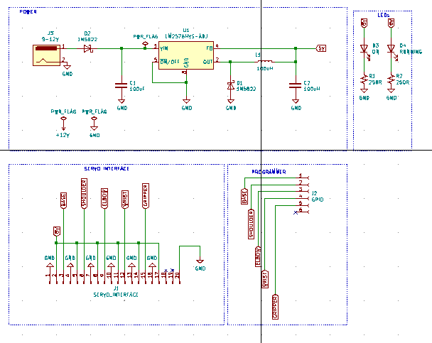

## Introduction
This repo contains files used to implement a basic pick and place robotic arm using 
[Wazidev](https://diy.waziup.io/sensors/WaziDev_board/WaziDev.html) board from [Wazihub](https://wazihub.com/).

## Schematic
The schematic is created using KICAD Design Software

## Circuit board

